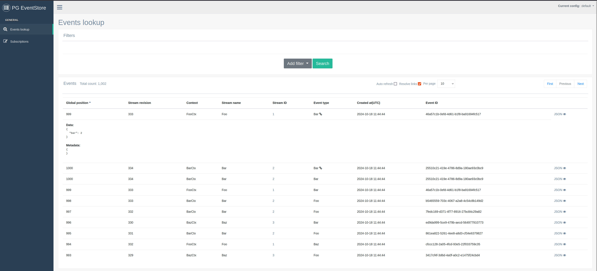

# Admin UI

`pg_eventstore` implements admin UI where you can browse various database objects. Key features:

- events lookup using filtering by stream context, stream name, stream id and event type
- subscriptions management and monitoring




## Authorization

Admin UI is implemented as a rack application. It doesn't have any built-in authentication/authorization mechanism - it is your responsibility to take care of it. Admin UI tries to look for `:admin_web_ui` config with a fallback to `:default` config. Thus, you can setup Admin UI-specific config, e.g. without some middlewares or so. Example:

```ruby
PgEventstore.configure(name: :admin_web_ui) do |config|
  config.middlewares = { my_admin_ui_middleware: AdminUIMiddleware.new }
end
```

### Rails integration

In your `config/routes.rb`:

```ruby
require 'pg_eventstore/web'

mount PgEventstore::Web::Application, at: '/eventstore'
```

### Standalone application

Create `config.ru` file and place next content in there:

```ruby
require 'pg_eventstore/web'

run PgEventstore::Web::Application
```

Now you can use any web server to run it.
